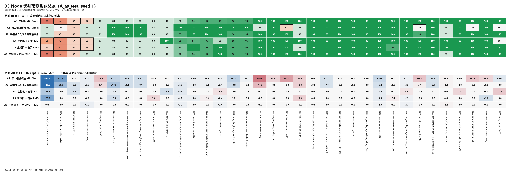

# A_as_test 小范围 Phase A 融合实验整合分析

> 生成日期：2026-08-26；测试范围：`A_as_test`、`seed_1`、`all_runs`。完整比较 A0、A1、A2、A4、A5、A6。

## 1. 结论摘要

- 在这一次单 fold、单 seed 测试中，按总体 Node Macro-F1 排名最高的是 **A2（双相机 0.5/0.5 概率后融合）**：93.75%，相对 A0 的 90.06% 为 **+3.70 pp**；其 Fault Node Macro-F1 变化为 **+8.02 pp**。
- **A1**：Node Macro-F1 +1.81 pp，Node accuracy +2.78 pp；Tier3 Macro-F1 +1.87 pp。
- **A2**：Node Macro-F1 +3.70 pp，Node accuracy +3.48 pp；Tier3 Macro-F1 +3.97 pp。
- **A4**：Node Macro-F1 +0.50 pp，Node accuracy +0.23 pp；Tier3 Macro-F1 +0.64 pp。
- **A5**：Node Macro-F1 +1.09 pp，Node accuracy +0.70 pp；Tier3 Macro-F1 +1.18 pp。
- **A6**：Node Macro-F1 +0.32 pp，Node accuracy +0.46 pp；Tier3 Macro-F1 +0.24 pp。
- **A2 的增益来源是一个本身就很强且与主视角互补的第二视角**：A1 单独已达到 94.43% accuracy / 91.87% Macro-F1，分别比 A0 +2.78 / +1.81 pp；A2 又比 A1 高 +0.70 / +1.89 pp。
- **A1 单独视角的提升也具有子集差异**：Normal/Fault Node Macro-F1 相对 A0 分别为 +0.03 / +6.23 pp；Stage 1 为 -2.54 pp，Stage 2 为 +4.56 pp，Stage 3 为 +1.87 pp；最弱类 Recall 为 66.67%。
- **A5 是当前最有希望的可穿戴条件**：总体/Fault Node Macro-F1 分别比 A0 +1.09 / +3.53 pp，最弱类 Recall 从 33.33% 提到 41.67%；但 Stage 1 Macro-F1 下降 -0.83 pp。
- **A4 的信号较弱且存在指标分歧**：Fault Macro-F1 为 +1.13 pp，满足当前以 Macro-F1 定义的单次非劣方向；但 Fault accuracy 为 -0.73 pp，不能概括为全面改善。
- **A6 没有表现出 EMG+IMU 的简单叠加收益**：总体 Macro-F1 只比 A0 +0.32 pp，低于 A5，最弱类 Recall 仍为 33.33%；Stage 3 Macro-F1 还下降 -0.91 pp。
- 这些数字只能回答“在 A 被留作测试者且 seed=1 时有没有迹象”，尚不能回答“传感器是否稳定有价值”。原验收规则要求 12 个 fold×seed 多数正增益、最弱类 Recall 与 Node Macro-F1 同升、Fault 不退化、压力测试和硬件预算均通过。

## 2. 数据完整性与可比性

六组预测均逐 `sample_name` 对齐到同一组 **431 clips**：Normal 294、Fault 137；Stage 1 66、Stage 2 308、Stage 3 57。所有条件保存的 node/Tier3 真值完全一致。

| 条件 | 训练前无传感器回退最大误差 | 训练后无传感器回退最大误差 |
| --- | --- | --- |
| A4 | 1.907e-06 | 1.907e-06 |
| A5 | 1.907e-06 | 1.907e-06 |
| A6 | 9.775e-06 | 9.775e-06 |

A4–A6 的误差量级约为浮点计算误差，支持“传感器缺失时回到 A0 路径”的实现正确性；但本次目录中没有压力测试输出，尚不能证明时间偏移、部分缺失等情形的鲁棒性。

## 3. 总体结果

| 条件 | 输入/融合 | Node Acc | ΔAcc pp | Node Macro-F1 | ΔF1 pp | 最弱 Node Recall | Tier3 Acc | Tier3 Macro-F1 | ΔF1 pp |
| --- | --- | --- | --- | --- | --- | --- | --- | --- | --- |
| A0 | 主相机 M2-Direct | 91.65% | — | 90.06% | — | 33.33% | 91.65% | 89.02% | — |
| A1 | 第二相机单独 M2-Direct | 94.43% | +2.78 | 91.87% | +1.81 | 66.67% | 94.43% | 90.89% | +1.87 |
| A2 | 双相机 0.5/0.5 概率后融合 | 95.13% | +3.48 | 93.75% | +3.70 | 66.67% | 95.13% | 92.99% | +3.97 |
| A4 | 主相机 + 右手 IMU | 91.88% | +0.23 | 90.55% | +0.50 | 41.67% | 91.88% | 89.66% | +0.64 |
| A5 | 主相机 + 右手 EMG | 92.34% | +0.70 | 91.15% | +1.09 | 41.67% | 92.34% | 90.20% | +1.18 |
| A6 | 主相机 + 右手 EMG + IMU | 92.11% | +0.46 | 90.38% | +0.32 | 33.33% | 92.11% | 89.26% | +0.24 |

A1 已作为完整候选纳入后续所有子集、类别、混淆和 bootstrap 表；A2 的增益需要同时相对 A0 与 A1 判断，才能区分“第二相机本身更强”和“双视角互补”两种来源。

### 3.1 A0 错误修正与新引入错误

| 条件 | 相对 A0 改变预测 | 修正 A0 错误 | 破坏 A0 正确 | 净正确数 | 两者都错 |
| --- | --- | --- | --- | --- | --- |
| A1 | 47 | 26 | 14 | +12 | 10 |
| A2 | 27 | 19 | 4 | +15 | 17 |
| A4 | 7 | 4 | 3 | +1 | 32 |
| A5 | 8 | 5 | 2 | +3 | 31 |
| A6 | 4 | 3 | 1 | +2 | 33 |

“净正确数”直接对应 accuracy 的净变化；Macro-F1 还会受到这些修正/损害落在哪些类别以及预测精度变化的影响。

## 4. Normal / Fault 与 Stage 分解

| 子集 | 条件 | N | Node Acc | ΔAcc pp | Node Macro-F1 | ΔF1 pp | Tier3 Macro-F1 |
| --- | --- | --- | --- | --- | --- | --- | --- |
| Normal | A0 | 294 | 93.20% | — | 91.35% | — | 90.42% |
| Normal | A1 | 294 | 94.56% | +1.36 | 91.38% | +0.03 | 90.32% |
| Normal | A2 | 294 | 95.58% | +2.38 | 93.12% | +1.77 | 92.29% |
| Normal | A4 | 294 | 93.88% | +0.68 | 91.71% | +0.36 | 90.69% |
| Normal | A5 | 294 | 93.54% | +0.34 | 91.57% | +0.22 | 90.71% |
| Normal | A6 | 294 | 93.54% | +0.34 | 91.54% | +0.19 | 90.57% |
| Fault | A0 | 137 | 88.32% | — | 86.72% | — | 85.48% |
| Fault | A1 | 137 | 94.16% | +5.84 | 92.95% | +6.23 | 92.16% |
| Fault | A2 | 137 | 94.16% | +5.84 | 94.73% | +8.02 | 94.05% |
| Fault | A4 | 137 | 87.59% | -0.73 | 87.85% | +1.13 | 87.50% |
| Fault | A5 | 137 | 89.78% | +1.46 | 90.25% | +3.53 | 89.14% |
| Fault | A6 | 137 | 89.05% | +0.73 | 87.20% | +0.48 | 85.70% |

| Stage | 条件 | N | Node Acc | ΔAcc pp | Node Macro-F1 | ΔF1 pp |
| --- | --- | --- | --- | --- | --- | --- |
| 1 | A0 | 66 | 89.39% | — | 92.51% | — |
| 1 | A1 | 66 | 87.88% | -1.52 | 89.97% | -2.54 |
| 1 | A2 | 66 | 92.42% | +3.03 | 93.72% | +1.21 |
| 1 | A4 | 66 | 89.39% | +0.00 | 92.51% | +0.00 |
| 1 | A5 | 66 | 87.88% | -1.52 | 91.68% | -0.83 |
| 1 | A6 | 66 | 90.91% | +1.52 | 93.50% | +0.99 |
| 2 | A0 | 308 | 92.86% | — | 92.99% | — |
| 2 | A1 | 308 | 96.75% | +3.90 | 97.55% | +4.56 |
| 2 | A2 | 308 | 96.10% | +3.25 | 96.73% | +3.74 |
| 2 | A4 | 308 | 92.86% | +0.00 | 92.96% | -0.03 |
| 2 | A5 | 308 | 93.51% | +0.65 | 93.60% | +0.61 |
| 2 | A6 | 308 | 93.51% | +0.65 | 93.66% | +0.67 |
| 3 | A0 | 57 | 87.72% | — | 92.27% | — |
| 3 | A1 | 57 | 89.47% | +1.75 | 94.14% | +1.87 |
| 3 | A2 | 57 | 92.98% | +5.26 | 96.36% | +4.09 |
| 3 | A4 | 57 | 89.47% | +1.75 | 92.97% | +0.70 |
| 3 | A5 | 57 | 91.23% | +3.51 | 95.27% | +3.00 |
| 3 | A6 | 57 | 85.96% | -1.75 | 91.36% | -0.91 |

## 5. 类别级影响：35 Node

### 5.1 类别影响总览图

上半图是各方法的绝对 Recall，类别按 A0 Recall 从低到高排列，粗框表示 Recall 低于 80%。下半图是候选方法相对 A0 的 F1 变化：蓝色为提高、红色为下降。如果上半图两个方法的 Recall 数字相同，而下半图 F1 仍有颜色变化，表示该类别正确数没有变，但其他类别误报进来的数量发生了变化，从而改变了 Precision 和 F1。

### 5.2 逐类别数值表

下表以真实类别为行。每个候选单元格为 `Recall变化 / F1变化 / 正确数净变化`；前两项单位均为百分点。小支持度类别的一两个 clip 就会造成很大的百分点波动，应同时看 support 与正确数。

| ID | Node | 支持 | A0 R | A0 F1 | A1 ΔR/ΔF1/Δ正确 | A2 ΔR/ΔF1/Δ正确 | A4 ΔR/ΔF1/Δ正确 | A5 ΔR/ΔF1/Δ正确 | A6 ΔR/ΔF1/Δ正确 |
| --- | --- | --- | --- | --- | --- | --- | --- | --- | --- |
| 1 | node_1_unlock_crimper | 6 | 66.7% | 72.7% | +0.0 / +0.0 / +0 | +0.0 / +7.3 / +0 | +0.0 / +7.3 / +0 | +0.0 / +0.0 / +0 | +0.0 / +0.0 / +0 |
| 2 | node_2_put_lock_on_table | 6 | 100.0% | 100.0% | -16.7 / -28.6 / -1 | +0.0 / -14.3 / +0 | +0.0 / +0.0 / +0 | +0.0 / +0.0 / +0 | +0.0 / +0.0 / +0 |
| 3 | node_3_turn_on_main_switch | 6 | 100.0% | 100.0% | +0.0 / -7.7 / +0 | +0.0 / +0.0 / +0 | +0.0 / +0.0 / +0 | +0.0 / +0.0 / +0 | +0.0 / +0.0 / +0 |
| 4 | node_4_turn_on_crimper | 6 | 83.3% | 83.3% | +0.0 / -11.9 / +0 | +0.0 / -6.4 / +0 | +0.0 / +0.0 / +0 | +0.0 / +0.0 / +0 | +0.0 / +0.0 / +0 |
| 5 | node_5_adjust_parameters | 6 | 100.0% | 100.0% | -33.3 / -20.0 / -2 | +0.0 / +0.0 / +0 | +0.0 / +0.0 / +0 | +0.0 / +0.0 / +0 | +0.0 / +0.0 / +0 |
| 6 | node_6_turn_on_air_compressor | 6 | 83.3% | 62.5% | +16.7 / +12.5 / +1 | +16.7 / +17.5 / +1 | +0.0 / +4.2 / +0 | +0.0 / +8.9 / +0 | +0.0 / +0.0 / +0 |
| 7 | node_7_turn_on_water_pump | 6 | 100.0% | 92.3% | -16.7 / -9.0 / -1 | -16.7 / -9.0 / -1 | +0.0 / +0.0 / +0 | -16.7 / -9.0 / -1 | +0.0 / +0.0 / +0 |
| 8 | node_8_turn_on_extractor_fan | 6 | 66.7% | 80.0% | +16.7 / +3.3 / +1 | +16.7 / +3.3 / +1 | +0.0 / +0.0 / +0 | +0.0 / +0.0 / +0 | +16.7 / +3.3 / +1 |
| 9 | node_9_move_pedal_to_safe_location | 6 | 100.0% | 100.0% | +0.0 / +0.0 / +0 | +0.0 / +0.0 / +0 | +0.0 / +0.0 / +0 | +0.0 / +0.0 / +0 | +0.0 / +0.0 / +0 |
| 10 | node_10_remove_protection_cover_from_crimper | 6 | 83.3% | 90.9% | +16.7 / +9.1 / +1 | +16.7 / +9.1 / +1 | +0.0 / +0.0 / +0 | +0.0 / +0.0 / +0 | +0.0 / +0.0 / +0 |
| 11 | node_11_put_protection_cover_on_ground | 6 | 100.0% | 92.3% | +0.0 / +7.7 / +0 | +0.0 / +7.7 / +0 | +0.0 / +0.0 / +0 | +0.0 / +0.0 / +0 | +0.0 / +0.0 / +0 |
| 12 | node_12_take_plier_from_table | 24 | 95.8% | 75.4% | +4.2 / +13.5 / +1 | +0.0 / +9.8 / +0 | +0.0 / +0.0 / +0 | +0.0 / -1.2 / +0 | +0.0 / +0.0 / +0 |
| 13 | node_13_grip_sample_from_table_1 | 24 | 95.8% | 97.9% | +4.2 / +2.1 / +1 | +0.0 / +0.0 / +0 | +0.0 / +0.0 / +0 | +0.0 / +0.0 / +0 | +0.0 / +0.0 / +0 |
| 14 | node_14_put_sample_under_electrodes_1 | 24 | 100.0% | 100.0% | +0.0 / +0.0 / +0 | +0.0 / +0.0 / +0 | +0.0 / +0.0 / +0 | +0.0 / +0.0 / +0 | +0.0 / +0.0 / +0 |
| 15 | node_15_press_pedal_1 | 24 | 100.0% | 100.0% | +0.0 / +0.0 / +0 | +0.0 / +0.0 / +0 | +0.0 / +0.0 / +0 | +0.0 / +0.0 / +0 | +0.0 / +0.0 / +0 |
| 16 | node_16_put_sample_on_machine_table_1 | 21 | 100.0% | 100.0% | +0.0 / +0.0 / +0 | +0.0 / +0.0 / +0 | +0.0 / +0.0 / +0 | +0.0 / +0.0 / +0 | +0.0 / +0.0 / +0 |
| 17 | node_17_grip_sample_from_machine_table_2 | 21 | 85.7% | 92.3% | +14.3 / +3.1 / +3 | +9.5 / +5.3 / +2 | +9.5 / +5.3 / +2 | +4.8 / +2.7 / +1 | +4.8 / +2.7 / +1 |
| 18 | node_18_reverse_sample | 21 | 100.0% | 89.4% | +0.0 / +10.6 / +0 | +0.0 / +8.3 / +0 | +0.0 / +4.0 / +0 | +0.0 / +4.0 / +0 | +0.0 / +1.9 / +0 |
| 19 | node_19_put_sample_on_machine_table_2 | 21 | 100.0% | 100.0% | +0.0 / +0.0 / +0 | +0.0 / +0.0 / +0 | +0.0 / +0.0 / +0 | -4.8 / -2.4 / -1 | +0.0 / +0.0 / +0 |
| 20 | node_20_grip_sample_from_machine_table_3 | 21 | 95.2% | 97.6% | +4.8 / +2.4 / +1 | +4.8 / +2.4 / +1 | +0.0 / +0.0 / +0 | +0.0 / -2.3 / +0 | +0.0 / +0.0 / +0 |
| 21 | node_21_put_sample_under_electrodes_2 | 21 | 100.0% | 97.7% | +0.0 / +2.3 / +0 | +0.0 / +2.3 / +0 | +0.0 / -4.3 / +0 | +0.0 / +2.3 / +0 | +0.0 / +2.3 / +0 |
| 22 | node_22_press_pedal_2 | 21 | 95.2% | 97.6% | +4.8 / +2.4 / +1 | +4.8 / +2.4 / +1 | -9.5 / -5.3 / -2 | +4.8 / +2.4 / +1 | +4.8 / +2.4 / +1 |
| 23 | node_23_inspect_sample | 17 | 94.1% | 97.0% | +5.9 / +3.0 / +1 | +5.9 / +3.0 / +1 | +0.0 / +0.0 / +0 | +5.9 / +3.0 / +1 | +0.0 / +0.0 / +0 |
| 24 | node_24_put_sample_on_table | 24 | 41.7% | 57.1% | +37.5 / +31.2 / +9 | +25.0 / +20.9 / +6 | +0.0 / +0.0 / +0 | +0.0 / +0.0 / +0 | +0.0 / +0.0 / +0 |
| 25 | node_25_put_plier_on_table | 24 | 100.0% | 100.0% | -20.8 / -11.6 / -5 | -4.2 / -2.1 / -1 | +0.0 / +0.0 / +0 | +0.0 / +0.0 / +0 | +0.0 / +0.0 / +0 |
| 26 | node_26_take_protection_cover_from_ground | 6 | 83.3% | 90.9% | +16.7 / +9.1 / +1 | +16.7 / +9.1 / +1 | +0.0 / +0.0 / +0 | +0.0 / +0.0 / +0 | +0.0 / +0.0 / +0 |
| 27 | node_27_put_protection_cover_on_crimper | 6 | 100.0% | 92.3% | +0.0 / +7.7 / +0 | +0.0 / +7.7 / +0 | +0.0 / +0.0 / +0 | +0.0 / +0.0 / +0 | +0.0 / +0.0 / +0 |
| 28 | node_28_turn_off_extractor_fan | 6 | 100.0% | 92.3% | -16.7 / -1.4 / -1 | -16.7 / -1.4 / -1 | +0.0 / +0.0 / +0 | +0.0 / +0.0 / +0 | -16.7 / -1.4 / -1 |
| 29 | node_29_turn_off_water_pump | 6 | 83.3% | 90.9% | +0.0 / +0.0 / +0 | +0.0 / +0.0 / +0 | +0.0 / +0.0 / +0 | +0.0 / -7.6 / +0 | +0.0 / +0.0 / +0 |
| 30 | node_30_turn_off_air_compressor | 6 | 33.3% | 44.4% | +50.0 / +46.5 / +3 | +50.0 / +46.5 / +3 | +16.7 / +15.6 / +1 | +33.3 / +28.3 / +2 | +0.0 / +0.0 / +0 |
| 31 | node_31_move_pedal_to_original_place | 6 | 100.0% | 100.0% | +0.0 / +0.0 / +0 | +0.0 / +0.0 / +0 | +0.0 / -7.7 / +0 | +0.0 / +0.0 / +0 | +0.0 / +0.0 / +0 |
| 32 | node_32_turn_off_crimper | 6 | 83.3% | 90.9% | +0.0 / +0.0 / +0 | +0.0 / +0.0 / +0 | +16.7 / +9.1 / +1 | +0.0 / +0.0 / +0 | +0.0 / +0.0 / +0 |
| 33 | node_33_turn_off_main_switch | 5 | 100.0% | 100.0% | -20.0 / -11.1 / -1 | +0.0 / +0.0 / +0 | +0.0 / +0.0 / +0 | +0.0 / +0.0 / +0 | +0.0 / +0.0 / +0 |
| 34 | node_34_take_lock_from_table | 5 | 100.0% | 90.9% | +0.0 / -7.6 / +0 | +0.0 / +0.0 / +0 | +0.0 / +0.0 / +0 | +0.0 / +9.1 / +0 | +0.0 / +0.0 / +0 |
| 35 | node_35_lock_crimper | 5 | 100.0% | 83.3% | -20.0 / +5.6 / -1 | +0.0 / +0.0 / +0 | -20.0 / -10.6 / -1 | +0.0 / +0.0 / +0 | +0.0 / +0.0 / +0 |

### 5.3 各融合方法最明显的 Node 增益与退化

**A1（第二相机单独 M2-Direct）**

- Recall 增益最大：`node_30_turn_off_air_compressor` (n=6, +50.0 pp, Δ正确=+3)；`node_24_put_sample_on_table` (n=24, +37.5 pp, Δ正确=+9)；`node_8_turn_on_extractor_fan` (n=6, +16.7 pp, Δ正确=+1)；`node_6_turn_on_air_compressor` (n=6, +16.7 pp, Δ正确=+1)；`node_10_remove_protection_cover_from_crimper` (n=6, +16.7 pp, Δ正确=+1)；`node_26_take_protection_cover_from_ground` (n=6, +16.7 pp, Δ正确=+1)
- Recall 退化最大：`node_5_adjust_parameters` (n=6, -33.3 pp, Δ正确=-2)；`node_25_put_plier_on_table` (n=24, -20.8 pp, Δ正确=-5)；`node_35_lock_crimper` (n=5, -20.0 pp, Δ正确=-1)；`node_33_turn_off_main_switch` (n=5, -20.0 pp, Δ正确=-1)；`node_28_turn_off_extractor_fan` (n=6, -16.7 pp, Δ正确=-1)；`node_7_turn_on_water_pump` (n=6, -16.7 pp, Δ正确=-1)
- 35 个受支持 Node 中：Recall 改善 12 类、退化 7 类、不变 16 类。

**A2（双相机 0.5/0.5 概率后融合）**

- Recall 增益最大：`node_30_turn_off_air_compressor` (n=6, +50.0 pp, Δ正确=+3)；`node_24_put_sample_on_table` (n=24, +25.0 pp, Δ正确=+6)；`node_8_turn_on_extractor_fan` (n=6, +16.7 pp, Δ正确=+1)；`node_6_turn_on_air_compressor` (n=6, +16.7 pp, Δ正确=+1)；`node_10_remove_protection_cover_from_crimper` (n=6, +16.7 pp, Δ正确=+1)；`node_26_take_protection_cover_from_ground` (n=6, +16.7 pp, Δ正确=+1)
- Recall 退化最大：`node_28_turn_off_extractor_fan` (n=6, -16.7 pp, Δ正确=-1)；`node_7_turn_on_water_pump` (n=6, -16.7 pp, Δ正确=-1)；`node_25_put_plier_on_table` (n=24, -4.2 pp, Δ正确=-1)
- 35 个受支持 Node 中：Recall 改善 10 类、退化 3 类、不变 22 类。

**A4（主相机 + 右手 IMU）**

- Recall 增益最大：`node_30_turn_off_air_compressor` (n=6, +16.7 pp, Δ正确=+1)；`node_32_turn_off_crimper` (n=6, +16.7 pp, Δ正确=+1)；`node_17_grip_sample_from_machine_table_2` (n=21, +9.5 pp, Δ正确=+2)
- Recall 退化最大：`node_35_lock_crimper` (n=5, -20.0 pp, Δ正确=-1)；`node_22_press_pedal_2` (n=21, -9.5 pp, Δ正确=-2)
- 35 个受支持 Node 中：Recall 改善 3 类、退化 2 类、不变 30 类。

**A5（主相机 + 右手 EMG）**

- Recall 增益最大：`node_30_turn_off_air_compressor` (n=6, +33.3 pp, Δ正确=+2)；`node_23_inspect_sample` (n=17, +5.9 pp, Δ正确=+1)；`node_17_grip_sample_from_machine_table_2` (n=21, +4.8 pp, Δ正确=+1)；`node_22_press_pedal_2` (n=21, +4.8 pp, Δ正确=+1)
- Recall 退化最大：`node_7_turn_on_water_pump` (n=6, -16.7 pp, Δ正确=-1)；`node_19_put_sample_on_machine_table_2` (n=21, -4.8 pp, Δ正确=-1)
- 35 个受支持 Node 中：Recall 改善 4 类、退化 2 类、不变 29 类。

**A6（主相机 + 右手 EMG + IMU）**

- Recall 增益最大：`node_8_turn_on_extractor_fan` (n=6, +16.7 pp, Δ正确=+1)；`node_17_grip_sample_from_machine_table_2` (n=21, +4.8 pp, Δ正确=+1)；`node_22_press_pedal_2` (n=21, +4.8 pp, Δ正确=+1)
- Recall 退化最大：`node_28_turn_off_extractor_fan` (n=6, -16.7 pp, Δ正确=-1)
- 35 个受支持 Node 中：Recall 改善 3 类、退化 1 类、不变 31 类。

### 5.4 各方法低 Recall Node 与误分类样本名称

这里将低 Recall 预定义为 **Recall < 80%**。表中列出造成低 Recall 的全部误分类样本，并给出该方法实际预测成的 Node。如需同时查看这些类别中预测正确的样本，可打开 `analysis/a_as_test_seed_1/LOW_RECALL_NODE_SAMPLE_INDEX.md`；便于筛选的逐样本表为 `analysis/a_as_test_seed_1/low_recall_node_samples.csv`。

#### A0 — 主相机 M2-Direct

| 低 Recall Node | 支持 | 正确 | Recall | 误分类样本 → 预测 Node | 备注 |
| --- | --- | --- | --- | --- | --- |
| node_1_unlock_crimper | 6 | 4/6 | 66.7% | `sample_000051` → `node_4_turn_on_crimper` `sample_000130` → `node_35_lock_crimper` | 样本质量良好 样本质量良 |
| node_8_turn_on_extractor_fan | 6 | 4/6 | 66.7% | `sample_000134` → `node_28_turn_off_extractor_fan` `sample_000278` → `node_6_turn_on_air_compressor`  | 样本质量良好 有严重遮挡 |
| node_24_put_sample_on_table | 24 | 10/24 | 41.7% | `sample_000038` → `node_12_take_plier_from_table` `sample_000073` → `node_12_take_plier_from_table` `sample_000087` → `node_12_take_plier_from_table` `sample_000150` → `node_12_take_plier_from_table` `sample_000178` → `node_12_take_plier_from_table` `sample_000226` → `node_34_take_lock_from_table` `sample_000232` → `node_12_take_plier_from_table` `sample_000238` → `node_12_take_plier_from_table` `sample_000259` → `node_12_take_plier_from_table` `sample_000265` → `node_12_take_plier_from_table` `sample_000309` → `node_12_take_plier_from_table` `sample_000315` → `node_12_take_plier_from_table` `sample_000329` → `node_12_take_plier_from_table` `sample_000430` → `node_12_take_plier_from_table` | 样本质量良好  样本质量良好  样本质量良好  样本质量良好  样本质量良好  样本质量良好  样本质量良好  样本质量良好  样本质量良好  样本质量良好  样本质量良好  样本质量良好 样本质量良好 样本质量良好 样本质量良好|
| node_30_turn_off_air_compressor | 6 | 2/6 | 33.3% | `sample_000041` → `node_6_turn_on_air_compressor` `sample_000118` → `node_6_turn_on_air_compressor` `sample_000269` → `node_6_turn_on_air_compressor` `sample_000336` → `node_6_turn_on_air_compressor` |有遮挡  样本质量良好 样本质量良好  样本质量良好|

#### A1 — 第二相机单独 M2-Direct

| 低 Recall Node | 支持 | 正确 | Recall | 误分类样本 → 预测 Node |  备注 |
| --- | --- | --- | --- | --- | --- |
| node_1_unlock_crimper | 6 | 4/6 | 66.7% | `sample_000051` → `node_4_turn_on_crimper` `sample_000130` → `node_4_turn_on_crimper` |样本质量良好 样本质量良好 |
| node_5_adjust_parameters | 6 | 4/6 | 66.7% | `sample_000137` → `node_6_turn_on_air_compressor` `sample_000214` → `node_17_grip_sample_from_machine_table_2` | 有遮挡  有遮挡|
| node_24_put_sample_on_table | 24 | 19/24 | 79.2% | `sample_000150` → `node_2_put_lock_on_table` `sample_000202` → `node_12_take_plier_from_table` `sample_000226` → `node_2_put_lock_on_table` `sample_000232` → `node_2_put_lock_on_table` `sample_000315` → `node_34_take_lock_from_table` |样本质量良好 样本质量良好 样本质量良好 样本质量良好 样本质量良好  |
| node_25_put_plier_on_table | 24 | 19/24 | 79.2% | `sample_000203` → `node_12_take_plier_from_table` `sample_000227` → `node_12_take_plier_from_table` `sample_000266` → `node_12_take_plier_from_table` `sample_000368` → `node_12_take_plier_from_table` `sample_000431` → `node_12_take_plier_from_table` |样本质量良好 样本质量良好 样本质量良好 样本质量良好 样本质量良好  |

#### A2 — 双相机 0.5/0.5 概率后融合

| 低 Recall Node | 支持 | 正确 | Recall | 误分类样本 → 预测 Node | 备注 |
| --- | --- | --- | --- | --- | --- |
| node_1_unlock_crimper | 6 | 4/6 | 66.7% | `sample_000051` → `node_4_turn_on_crimper` `sample_000130` → `node_35_lock_crimper` |样本质量良好 样本质量良好  |
| node_24_put_sample_on_table | 24 | 16/24 | 66.7% | `sample_000073` → `node_12_take_plier_from_table` `sample_000150` → `node_2_put_lock_on_table` `sample_000226` → `node_2_put_lock_on_table` `sample_000232` → `node_12_take_plier_from_table` `sample_000238` → `node_12_take_plier_from_table` `sample_000259` → `node_12_take_plier_from_table` `sample_000309` → `node_12_take_plier_from_table` `sample_000315` → `node_34_take_lock_from_table` | 样本质量良好  样本质量良好  样本质量良好  样本质量良好  样本质量良好  样本质量良好  样本质量良好  样本质量良好  |

#### A4 — 主相机 + 右手 IMU

| 低 Recall Node | 支持 | 正确 | Recall | 误分类样本 → 预测 Node | 备注 |
| --- | --- | --- | --- | --- | --- |
| node_1_unlock_crimper | 6 | 4/6 | 66.7% | `sample_000051` → `node_4_turn_on_crimper` `sample_000130` → `node_35_lock_crimper` |样本质量良好 样本质量良好 |
| node_8_turn_on_extractor_fan | 6 | 4/6 | 66.7% | `sample_000134` → `node_28_turn_off_extractor_fan` `sample_000278` → `node_6_turn_on_air_compressor` |样本质量良好 有严重遮挡|
| node_24_put_sample_on_table | 24 | 10/24 | 41.7% | `sample_000038` → `node_12_take_plier_from_table` `sample_000073` → `node_12_take_plier_from_table` `sample_000087` → `node_12_take_plier_from_table` `sample_000150` → `node_12_take_plier_from_table` `sample_000178` → `node_12_take_plier_from_table` `sample_000226` → `node_34_take_lock_from_table` `sample_000232` → `node_12_take_plier_from_table` `sample_000238` → `node_12_take_plier_from_table` `sample_000259` → `node_12_take_plier_from_table` `sample_000265` → `node_12_take_plier_from_table` `sample_000309` → `node_12_take_plier_from_table` `sample_000315` → `node_12_take_plier_from_table` `sample_000329` → `node_12_take_plier_from_table` `sample_000430` → `node_12_take_plier_from_table` |样本质量良好 样本质量良好 样本质量良好 样本质量良好 样本质量良好 样本质量良好 样本质量良好 样本质量良好 样本质量良好 样本质量良好 样本质量良好 样本质量良好 样本质量良好 样本质量良好 |
| node_30_turn_off_air_compressor | 6 | 3/6 | 50.0% | `sample_000041` → `node_6_turn_on_air_compressor` `sample_000118` → `node_6_turn_on_air_compressor` `sample_000336` → `node_6_turn_on_air_compressor` |有遮挡  样本质量良好 样本质量良好|

#### A5 — 主相机 + 右手 EMG

| 低 Recall Node | 支持 | 正确 | Recall | 误分类样本 → 预测 Node |备注 |
| --- | --- | --- | --- | --- |--- |
| node_1_unlock_crimper | 6 | 4/6 | 66.7% | `sample_000051` → `node_4_turn_on_crimper` `sample_000130` → `node_35_lock_crimper` |样本质量良好 样本质量良好 |
| node_8_turn_on_extractor_fan | 6 | 4/6 | 66.7% | `sample_000134` → `node_28_turn_off_extractor_fan` `sample_000278` → `node_6_turn_on_air_compressor` |样本质量良好 有严重遮挡|
| node_24_put_sample_on_table | 24 | 10/24 | 41.7% | `sample_000038` → `node_12_take_plier_from_table` `sample_000073` → `node_12_take_plier_from_table` `sample_000087` → `node_12_take_plier_from_table` `sample_000150` → `node_12_take_plier_from_table` `sample_000178` → `node_12_take_plier_from_table` `sample_000226` → `node_12_take_plier_from_table` `sample_000232` → `node_12_take_plier_from_table` `sample_000238` → `node_12_take_plier_from_table` `sample_000259` → `node_12_take_plier_from_table` `sample_000265` → `node_12_take_plier_from_table` `sample_000309` → `node_12_take_plier_from_table` `sample_000315` → `node_12_take_plier_from_table` `sample_000329` → `node_12_take_plier_from_table` `sample_000430` → `node_12_take_plier_from_table` |样本质量良好 样本质量良好 样本质量良好 样本质量良好 样本质量良好 样本质量良好 样本质量良好 样本质量良好 样本质量良好 样本质量良好 样本质量良好 样本质量良好 样本质量良好 样本质量良好 |
| node_30_turn_off_air_compressor | 6 | 4/6 | 66.7% | `sample_000118` → `node_6_turn_on_air_compressor` `sample_000336` → `node_6_turn_on_air_compressor` |样本质量良好 样本质量良好|

#### A6 — 主相机 + 右手 EMG + IMU

| 低 Recall Node | 支持 | 正确 | Recall | 误分类样本 → 预测 Node |备注 |
| --- | --- | --- | --- | --- |--- |
| node_1_unlock_crimper | 6 | 4/6 | 66.7% | `sample_000051` → `node_4_turn_on_crimper` `sample_000130` → `node_35_lock_crimper` |样本质量良好 样本质量良好 |
| node_24_put_sample_on_table | 24 | 10/24 | 41.7% | `sample_000038` → `node_12_take_plier_from_table` `sample_000073` → `node_12_take_plier_from_table` `sample_000087` → `node_12_take_plier_from_table` `sample_000150` → `node_12_take_plier_from_table` `sample_000178` → `node_12_take_plier_from_table` `sample_000226` → `node_34_take_lock_from_table` `sample_000232` → `node_12_take_plier_from_table` `sample_000238` → `node_12_take_plier_from_table` `sample_000259` → `node_12_take_plier_from_table` `sample_000265` → `node_12_take_plier_from_table` `sample_000309` → `node_12_take_plier_from_table` `sample_000315` → `node_12_take_plier_from_table` `sample_000329` → `node_12_take_plier_from_table` `sample_000430` → `node_12_take_plier_from_table` |样本质量良好 样本质量良好 样本质量良好 样本质量良好 样本质量良好 样本质量良好 样本质量良好 样本质量良好 样本质量良好 样本质量良好 样本质量良好 样本质量良好 样本质量良好 样本质量良好 |
| node_30_turn_off_air_compressor | 6 | 2/6 | 33.3% | `sample_000041` → `node_6_turn_on_air_compressor` `sample_000118` → `node_6_turn_on_air_compressor` `sample_000269` → `node_6_turn_on_air_compressor` `sample_000336` → `node_6_turn_on_air_compressor` |有遮挡  样本质量良好 样本质量良好  样本质量良好|

## 6. 类别级影响：31 Tier3

| ID | Tier3 | 支持 | A0 R | A0 F1 | A1 ΔR/ΔF1/Δ正确 | A2 ΔR/ΔF1/Δ正确 | A4 ΔR/ΔF1/Δ正确 | A5 ΔR/ΔF1/Δ正确 | A6 ΔR/ΔF1/Δ正确 |
| --- | --- | --- | --- | --- | --- | --- | --- | --- | --- |
| 0 | adjust parameters | 6 | 100.0% | 100.0% | -33.3 / -20.0 / -2 | +0.0 / +0.0 / +0 | +0.0 / +0.0 / +0 | +0.0 / +0.0 / +0 | +0.0 / +0.0 / +0 |
| 1 | grip sample from machine table | 42 | 90.5% | 95.0% | +9.5 / +2.7 / +4 | +7.1 / +3.8 / +3 | +4.8 / +2.6 / +2 | +2.4 / +0.1 / +1 | +2.4 / +1.3 / +1 |
| 2 | grip sample from table | 24 | 95.8% | 97.9% | +4.2 / +2.1 / +1 | +0.0 / +0.0 / +0 | +0.0 / +0.0 / +0 | +0.0 / +0.0 / +0 | +0.0 / +0.0 / +0 |
| 3 | inspect sample | 17 | 94.1% | 97.0% | +5.9 / +3.0 / +1 | +5.9 / +3.0 / +1 | +0.0 / +0.0 / +0 | +5.9 / +3.0 / +1 | +0.0 / +0.0 / +0 |
| 4 | lock crimper | 5 | 100.0% | 83.3% | -20.0 / +5.6 / -1 | +0.0 / +0.0 / +0 | -20.0 / -10.6 / -1 | +0.0 / +0.0 / +0 | +0.0 / +0.0 / +0 |
| 5 | move pedal to original location | 6 | 100.0% | 100.0% | +0.0 / +0.0 / +0 | +0.0 / +0.0 / +0 | +0.0 / -7.7 / +0 | +0.0 / +0.0 / +0 | +0.0 / +0.0 / +0 |
| 6 | move pedal to safe location | 6 | 100.0% | 100.0% | +0.0 / +0.0 / +0 | +0.0 / +0.0 / +0 | +0.0 / +0.0 / +0 | +0.0 / +0.0 / +0 | +0.0 / +0.0 / +0 |
| 7 | place sample under electrodes | 45 | 100.0% | 98.9% | +0.0 / +1.1 / +0 | +0.0 / +1.1 / +0 | +0.0 / -2.1 / +0 | +0.0 / +1.1 / +0 | +0.0 / +1.1 / +0 |
| 8 | press pedal | 45 | 97.8% | 98.9% | +2.2 / +1.1 / +1 | +2.2 / +1.1 / +1 | -4.4 / -2.3 / -2 | +2.2 / +1.1 / +1 | +2.2 / +1.1 / +1 |
| 9 | put lock on table | 6 | 100.0% | 100.0% | -16.7 / -28.6 / -1 | +0.0 / -14.3 / +0 | +0.0 / +0.0 / +0 | +0.0 / +0.0 / +0 | +0.0 / +0.0 / +0 |
| 10 | put plier on table | 24 | 100.0% | 100.0% | -20.8 / -11.6 / -5 | -4.2 / -2.1 / -1 | +0.0 / +0.0 / +0 | +0.0 / +0.0 / +0 | +0.0 / +0.0 / +0 |
| 11 | put protection cover on crimper | 6 | 100.0% | 92.3% | +0.0 / +7.7 / +0 | +0.0 / +7.7 / +0 | +0.0 / +0.0 / +0 | +0.0 / +0.0 / +0 | +0.0 / +0.0 / +0 |
| 12 | put protection cover on ground | 6 | 100.0% | 92.3% | +0.0 / +7.7 / +0 | +0.0 / +7.7 / +0 | +0.0 / +0.0 / +0 | +0.0 / +0.0 / +0 | +0.0 / +0.0 / +0 |
| 13 | put sample on machine table | 42 | 100.0% | 100.0% | +0.0 / +0.0 / +0 | +0.0 / +0.0 / +0 | +0.0 / +0.0 / +0 | -2.4 / -1.2 / -1 | +0.0 / +0.0 / +0 |
| 14 | put sample on table | 24 | 41.7% | 57.1% | +37.5 / +31.2 / +9 | +25.0 / +20.9 / +6 | +0.0 / +0.0 / +0 | +0.0 / +0.0 / +0 | +0.0 / +0.0 / +0 |
| 15 | remove protection cover from crimper | 6 | 83.3% | 90.9% | +16.7 / +9.1 / +1 | +16.7 / +9.1 / +1 | +0.0 / +0.0 / +0 | +0.0 / +0.0 / +0 | +0.0 / +0.0 / +0 |
| 16 | reverse sample | 21 | 100.0% | 89.4% | +0.0 / +10.6 / +0 | +0.0 / +8.3 / +0 | +0.0 / +4.0 / +0 | +0.0 / +4.0 / +0 | +0.0 / +1.9 / +0 |
| 17 | take lock from table | 5 | 100.0% | 90.9% | +0.0 / -7.6 / +0 | +0.0 / +0.0 / +0 | +0.0 / +0.0 / +0 | +0.0 / +9.1 / +0 | +0.0 / +0.0 / +0 |
| 18 | take plier from table | 24 | 95.8% | 75.4% | +4.2 / +13.5 / +1 | +0.0 / +9.8 / +0 | +0.0 / +0.0 / +0 | +0.0 / -1.2 / +0 | +0.0 / +0.0 / +0 |
| 19 | take protection cover from ground | 6 | 83.3% | 90.9% | +16.7 / +9.1 / +1 | +16.7 / +9.1 / +1 | +0.0 / +0.0 / +0 | +0.0 / +0.0 / +0 | +0.0 / +0.0 / +0 |
| 20 | turn off air compressor | 6 | 33.3% | 44.4% | +50.0 / +46.5 / +3 | +50.0 / +46.5 / +3 | +16.7 / +15.6 / +1 | +33.3 / +28.3 / +2 | +0.0 / +0.0 / +0 |
| 21 | turn off crimper | 6 | 83.3% | 90.9% | +0.0 / +0.0 / +0 | +0.0 / +0.0 / +0 | +16.7 / +9.1 / +1 | +0.0 / +0.0 / +0 | +0.0 / +0.0 / +0 |
| 22 | turn off extractor fan | 6 | 100.0% | 92.3% | -16.7 / -1.4 / -1 | -16.7 / -1.4 / -1 | +0.0 / +0.0 / +0 | +0.0 / +0.0 / +0 | -16.7 / -1.4 / -1 |
| 23 | turn off main switch | 5 | 100.0% | 100.0% | -20.0 / -11.1 / -1 | +0.0 / +0.0 / +0 | +0.0 / +0.0 / +0 | +0.0 / +0.0 / +0 | +0.0 / +0.0 / +0 |
| 24 | turn off water pump | 6 | 83.3% | 90.9% | +0.0 / +0.0 / +0 | +0.0 / +0.0 / +0 | +0.0 / +0.0 / +0 | +0.0 / -7.6 / +0 | +0.0 / +0.0 / +0 |
| 25 | turn on air compressor | 6 | 83.3% | 62.5% | +16.7 / +12.5 / +1 | +16.7 / +17.5 / +1 | +0.0 / +4.2 / +0 | +0.0 / +8.9 / +0 | +0.0 / +0.0 / +0 |
| 26 | turn on crimper | 6 | 83.3% | 83.3% | +0.0 / -11.9 / +0 | +0.0 / -6.4 / +0 | +0.0 / +0.0 / +0 | +0.0 / +0.0 / +0 | +0.0 / +0.0 / +0 |
| 27 | turn on extractor fan | 6 | 66.7% | 80.0% | +16.7 / +3.3 / +1 | +16.7 / +3.3 / +1 | +0.0 / +0.0 / +0 | +0.0 / +0.0 / +0 | +16.7 / +3.3 / +1 |
| 28 | turn on main switch | 6 | 100.0% | 100.0% | +0.0 / -7.7 / +0 | +0.0 / +0.0 / +0 | +0.0 / +0.0 / +0 | +0.0 / +0.0 / +0 | +0.0 / +0.0 / +0 |
| 29 | turn on water pump | 6 | 100.0% | 92.3% | -16.7 / -9.0 / -1 | -16.7 / -9.0 / -1 | +0.0 / +0.0 / +0 | -16.7 / -9.0 / -1 | +0.0 / +0.0 / +0 |
| 30 | unlock crimper | 6 | 66.7% | 72.7% | +0.0 / +0.0 / +0 | +0.0 / +7.3 / +0 | +0.0 / +7.3 / +0 | +0.0 / +0.0 / +0 | +0.0 / +0.0 / +0 |

## 7. 混淆对变化

### 7.1 A0 当前前 12 个 Node 混淆对在各融合中的变化

| 真实 → 预测 | A0 | A1 数量(Δ) | A2 数量(Δ) | A4 数量(Δ) | A5 数量(Δ) | A6 数量(Δ) |
| --- | --- | --- | --- | --- | --- | --- |
| node_24_put_sample_on_table → node_12_take_plier_from_table | 13 | 1 (-12) | 5 (-8) | 13 (+0) | 14 (+1) | 13 (+0) |
| node_30_turn_off_air_compressor → node_6_turn_on_air_compressor | 4 | 1 (-3) | 1 (-3) | 3 (-1) | 2 (-2) | 4 (+0) |
| node_17_grip_sample_from_machine_table_2 → node_18_reverse_sample | 3 | 0 (-3) | 1 (-2) | 1 (-2) | 2 (-1) | 2 (-1) |
| node_23_inspect_sample → node_18_reverse_sample | 1 | 0 (-1) | 0 (-1) | 1 (+0) | 0 (-1) | 1 (+0) |
| node_1_unlock_crimper → node_4_turn_on_crimper | 1 | 2 (+1) | 1 (+0) | 1 (+0) | 1 (+0) | 1 (+0) |
| node_1_unlock_crimper → node_35_lock_crimper | 1 | 0 (-1) | 1 (+0) | 1 (+0) | 1 (+0) | 1 (+0) |
| node_4_turn_on_crimper → node_35_lock_crimper | 1 | 0 (-1) | 1 (+0) | 1 (+0) | 1 (+0) | 1 (+0) |
| node_6_turn_on_air_compressor → node_30_turn_off_air_compressor | 1 | 0 (-1) | 0 (-1) | 1 (+0) | 1 (+0) | 1 (+0) |
| node_8_turn_on_extractor_fan → node_28_turn_off_extractor_fan | 1 | 0 (-1) | 0 (-1) | 1 (+0) | 1 (+0) | 0 (-1) |
| node_32_turn_off_crimper → node_1_unlock_crimper | 1 | 0 (-1) | 0 (-1) | 0 (-1) | 1 (+0) | 1 (+0) |
| node_29_turn_off_water_pump → node_7_turn_on_water_pump | 1 | 1 (+0) | 1 (+0) | 1 (+0) | 1 (+0) | 1 (+0) |
| node_10_remove_protection_cover_from_crimper → node_27_put_protection_cover_on_crimper | 1 | 0 (-1) | 0 (-1) | 1 (+0) | 1 (+0) | 1 (+0) |

### 7.2 各方法新引入/放大的主要混淆

- **A1**：`node_25_put_plier_on_table → node_12_take_plier_from_table` 5 次（比 A0 +5）；`node_24_put_sample_on_table → node_2_put_lock_on_table` 3 次（比 A0 +3）；`node_1_unlock_crimper → node_4_turn_on_crimper` 2 次（比 A0 +1）；`node_35_lock_crimper → node_1_unlock_crimper` 1 次（比 A0 +1）；`node_33_turn_off_main_switch → node_3_turn_on_main_switch` 1 次（比 A0 +1）；`node_32_turn_off_crimper → node_4_turn_on_crimper` 1 次（比 A0 +1）
- **A2**：`node_24_put_sample_on_table → node_2_put_lock_on_table` 2 次（比 A0 +2）；`node_32_turn_off_crimper → node_4_turn_on_crimper` 1 次（比 A0 +1）；`node_28_turn_off_extractor_fan → node_8_turn_on_extractor_fan` 1 次（比 A0 +1）；`node_25_put_plier_on_table → node_12_take_plier_from_table` 1 次（比 A0 +1）；`node_7_turn_on_water_pump → node_6_turn_on_air_compressor` 1 次（比 A0 +1）
- **A4**：`node_22_press_pedal_2 → node_21_put_sample_under_electrodes_2` 3 次（比 A0 +2）；`node_35_lock_crimper → node_31_move_pedal_to_original_place` 1 次（比 A0 +1）
- **A5**：`node_24_put_sample_on_table → node_12_take_plier_from_table` 14 次（比 A0 +1）；`node_19_put_sample_on_machine_table_2 → node_20_grip_sample_from_machine_table_3` 1 次（比 A0 +1）；`node_7_turn_on_water_pump → node_29_turn_off_water_pump` 1 次（比 A0 +1）
- **A6**：`node_28_turn_off_extractor_fan → node_8_turn_on_extractor_fan` 1 次（比 A0 +1）

## 8. 右手 IMU 与 EMG 的互补性

| 样本关系 | clips | 含义 |
| --- | --- | --- |
| A4 对、A5 错 | 4 | 偏向 IMU 有利样本 |
| A5 对、A4 错 | 6 | 偏向 EMG 有利样本 |
| A4/A5 都错，A6 修正 | 1 | 传感器内部互补的直接证据 |
| A4/A5 至少一个对，A6 变错 | 6 | 联合融合覆盖单传感器优势的代价 |
| A0 错且 A4/A5/A6 至少一个修正 | 8 | 可穿戴信息池的潜在上限线索 |

A6 是否优于 A4/A5，不能只看总分；关键是它能否保留两种单传感器各自修正的类别，同时减少联合后新引入的错误。上表与第 5 节的类别净正确数应结合解读。

## 9. 探索性 paired clip-level bootstrap

使用 10000 次配对 clip bootstrap；每次在 `Normal/Fault × Stage` 联合层内有放回抽样，保持各层样本量，并在同一次抽样中同时计算候选与 A0。CI 是本次 A_as_test/seed_1 测试集上的采样不确定性，不包含换测试者、换 seed 或重新训练的不确定性。

| 条件 | 指标 | 平均 Δ pp | 95% CI (pp) | P(Δ>0) |
| --- | --- | --- | --- | --- |
| A1 | Node accuracy | +2.80 | [+0.00, +5.57] | 97.2% |
| A1 | Node Macro-F1 | +1.83 | [-2.38, +5.81] | 80.8% |
| A1 | Node Macro-Recall | +1.40 | [-2.59, +5.06] | 77.1% |
| A1 | Tier3 Macro-F1 | +1.88 | [-2.88, +6.35] | 78.7% |
| A1 | Normal Node Macro-F1 | -0.12 | [-5.45, +4.81] | 49.0% |
| A1 | Fault Node Macro-F1 | +6.82 | [-0.00, +13.52] | 97.5% |
| A2 | Node accuracy | +3.48 | [+1.39, +5.80] | 99.9% |
| A2 | Node Macro-F1 | +3.87 | [+0.40, +7.28] | 98.5% |
| A2 | Node Macro-Recall | +3.70 | [+0.56, +6.75] | 98.7% |
| A2 | Tier3 Macro-F1 | +4.15 | [+0.28, +7.96] | 98.1% |
| A2 | Normal Node Macro-F1 | +1.78 | [-2.70, +5.99] | 79.2% |
| A2 | Fault Node Macro-F1 | +8.65 | [+3.15, +14.29] | 99.9% |
| A4 | Node accuracy | +0.24 | [-0.93, +1.39] | 57.6% |
| A4 | Node Macro-F1 | +0.49 | [-1.38, +2.56] | 68.8% |
| A4 | Node Macro-Recall | +0.39 | [-1.46, +2.26] | 66.5% |
| A4 | Tier3 Macro-F1 | +0.64 | [-1.44, +2.91] | 72.2% |
| A4 | Normal Node Macro-F1 | +0.35 | [-1.82, +2.72] | 62.6% |
| A4 | Fault Node Macro-F1 | +0.61 | [-2.55, +3.65] | 59.1% |
| A5 | Node accuracy | +0.69 | [-0.46, +1.86] | 82.3% |
| A5 | Node Macro-F1 | +1.10 | [-0.76, +3.01] | 87.2% |
| A5 | Node Macro-Recall | +0.77 | [-0.87, +2.43] | 82.3% |
| A5 | Tier3 Macro-F1 | +1.19 | [-0.85, +3.29] | 86.9% |
| A5 | Normal Node Macro-F1 | +0.21 | [-2.10, +2.55] | 57.4% |
| A5 | Fault Node Macro-F1 | +2.81 | [-0.06, +5.95] | 92.6% |
| A6 | Node accuracy | +0.46 | [-0.46, +1.39] | 77.1% |
| A6 | Node Macro-F1 | +0.34 | [-1.23, +2.09] | 66.2% |
| A6 | Node Macro-Recall | +0.27 | [-1.10, +1.68] | 64.5% |
| A6 | Tier3 Macro-F1 | +0.25 | [-1.49, +2.21] | 62.8% |
| A6 | Normal Node Macro-F1 | +0.20 | [-2.24, +2.69] | 55.6% |
| A6 | Fault Node Macro-F1 | +0.58 | [+0.00, +2.00] | 63.2% |

若 CI 跨 0，应视为本次测试集不足以区分候选与 A0；即便 CI 不跨 0，也仍需完成其余 11 个 fold×seed，才能判断训练稳定性与跨参与者泛化。

## 10. 当前证据对 Phase A 门槛的回答

### 10.1 只针对当前一次运行的方向性检查

| 条件 | Δ总体 Node Macro-F1 pp | Δ最弱 Node Recall pp | ΔFault Node Macro-F1 pp | Macro-F1+最弱Recall同升 | Fault非劣(−0.5 pp) |
| --- | --- | --- | --- | --- | --- |
| A1 | +1.81 | +33.33 | +6.23 | 是 | 是 |
| A2 | +3.70 | +33.33 | +8.02 | 是 | 是 |
| A4 | +0.50 | +8.33 | +1.13 | 是 | 是 |
| A5 | +1.09 | +8.33 | +3.53 | 是 | 是 |
| A6 | +0.32 | +0.00 | +0.48 | 否 | 是 |

A1, A2, A4, A5 在这一运行中满足 Macro-F1 与最弱 Recall 同升；A6 不满足。这不是正式通过：正式门槛要求上述方向在 12 个 fold×seed 中至少 7 个成立，并同时检查 Fault 非劣。

### 10.2 完整 Phase A 状态

| 门槛 | 当前状态 | 说明 |
| --- | --- | --- |
| 12 个 fold×seed 中多数正增益 | 未满足/未评估 | 当前只有 A_as_test × seed_1（1/12） |
| Node Macro-F1 与最弱类别 Recall 同时改善 | 可做单次检查 | 总体表给出本次结果；仍需 12 次一致性 |
| Fault 不退化 | 可做单次检查 | Normal/Fault 表给出本次变化；正式阈值为 -0.5 pp 非劣界 |
| 缺失模态/时间偏差仍回退接近 A0 | 部分满足 | A4-A6 无传感器回退数值等价已验证；A2 缺第二相机及各条件压力测试尚缺；A1 为第二相机单独模型，本身不具备回退 A0 的输入路径 |
| 延迟与吞吐满足硬件预算 | 未评估 | 配置中的目标硬件、P95 延迟和最低吞吐预算仍为空 |

## 11. 建议的下一步

1. 先把 A_as_test 的 seed 2、42 补齐，观察本报告中最显著的类别增益是否换 seed 后仍存在；若类别方向反复翻转，暂不扩大到四折。
2. 对 A2 增加第二相机缺失/失步测试，并对 A4/A5/A6 运行缺失模态与 ±5%、±10%、±20% 时间偏移压力测试；重点检查总体、Fault、边界相关类别及 A0 回退差距。
3. 本次 A1 自身强于 A0，且 A2 进一步强于 A1，已经形成继续测试 A3 gated residual/cross-view 的充分探索性理由；固定 0.5/0.5 应保留为无调参基线，不要在测试集上搜索权重。
4. 若 A4 与 A5 各自改善不同类别、而 A6 未能保留两者优势，下一版应加入按 clip/时间步的传感器 gate、modality dropout 和显式缺失标记，而不是简单同时叠加 adapter。
5. 在扩展到 12 个 fold×seed 前填写目标硬件预算，并记录端到端 RGB 解码/主干/融合/后处理延迟；当前 benchmark 仅覆盖缓存特征后的融合与 head。

## 12. 可复核产物

- `analysis/a_as_test_seed_1/node_classwise_deltas_vs_A0.csv`：35 Node 完整类别指标与差值。
- `analysis/a_as_test_seed_1/tier3_classwise_deltas_vs_A0.csv`：31 Tier3 完整类别指标与差值。
- `analysis/a_as_test_seed_1/node_correction_flow_vs_A0.csv`：修正/损害/净正确数。
- `analysis/a_as_test_seed_1/node_rescue_harm_by_true_class.csv`：按真实 Node 的修正与损害计数。
- `analysis/a_as_test_seed_1/node_class_impact_heatmap.png`：报告内嵌的 35 Node Recall/F1 类别影响总览图。
- `analysis/a_as_test_seed_1/node_class_impact_heatmap.svg`：同一图的可无限放大矢量版本。
- `analysis/a_as_test_seed_1/LOW_RECALL_NODE_SAMPLE_INDEX.md`：每个方法低 Recall 类别的完整样本名，区分正确/错误。
- `analysis/a_as_test_seed_1/low_recall_node_samples.csv`：低 Recall 类别逐样本明细，可按方法、类别、Normal/Fault、Stage、run 筛选。
- `analysis/a_as_test_seed_1/paired_bootstrap_exploratory.json`：探索性 bootstrap 原始汇总。
- 复现命令：`python tools/analyze_small_scope_a_as_test.py`。
